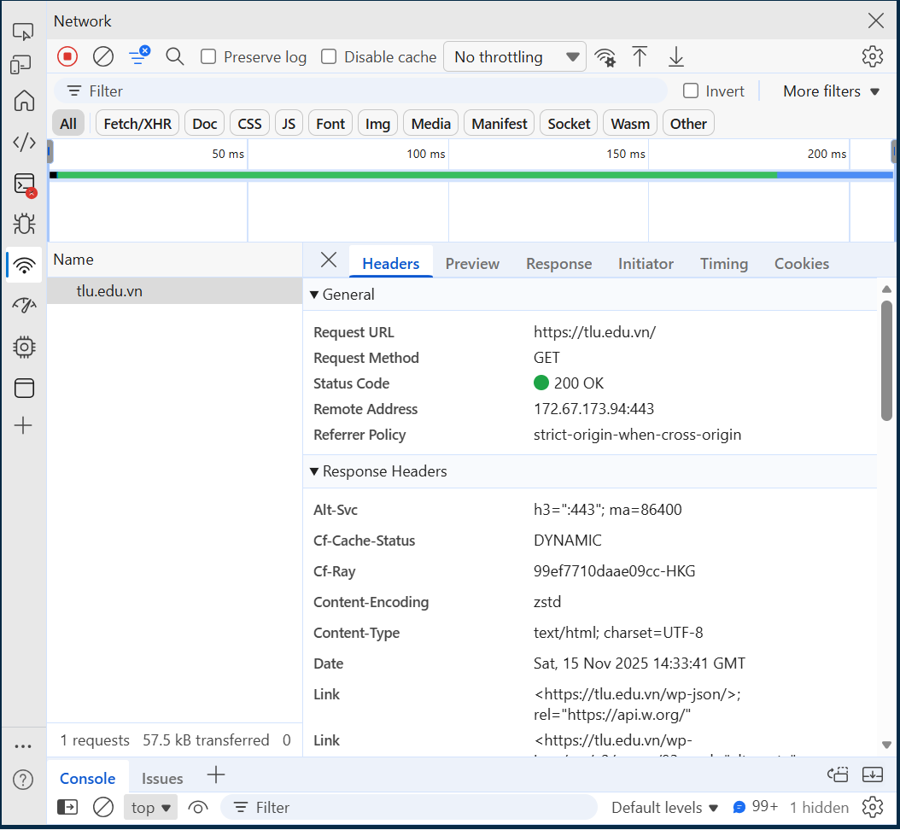

## Chương 1

A. Ảnh chụp màn hình Kết quả (Trình duyệt Web): 


B. Thông tin trích xuất: 


1. Request URL: https://tlu.edu.vn/
2. Request Method: GET
3. Status Code: 200 OK

Câu hỏi của tôi là: Vì sao em nhìn trang web trông thấy ảnh, text,vv đều đã hiện, mọi thứ đều hiện xong rồi, nhưng tab Network vẫn đang chạy request?

## Chương 2

```
<!DOCTYPE html>
<html lang="vi">
<head>
<meta charset="UTF-8">
<title>PHT Chương 2 - PHP Căn Bản</title>
</head>
<body>
<h1>Kết quả PHP Căn Bản</h1>
<?php
    // TODO 1: Khai báo 3 biến
    $ho_ten = "Nguyễn Thị Phương Thảo";
    $diem_tb = 8.5;
    $co_di_hoc_chuyen_can = true; // (hoặc false)

    // TODO 2: In ra thông tin sinh viên
    // Dùng lệnh echo để in ra: "Họ tên: $ho_ten", "Điểm: $diem_tb"
    // (Lưu ý: Phải in ra cả thẻ <br> để xuống dòng trong HTML)
    echo "Họ tên: $ho_ten <br> Điểm: $diem_tb <br>";

    // TODO 3: Viết cấu trúc IF/ELSE IF/ELSE (2.2)
    // Dựa vào $diem_tb, in ra xếp loại:
    // - Nếu $diem_tb >= 8.5 VÀ $co_di_hoc_chuyen_can == true => "Xếp loại: Giỏi"
    // - Ngược lại, nếu $diem_tb >= 6.5 VÀ $co_di_hoc_chuyen_can == true => "Xếp loại: Khá"
    // - Ngược lại, nếu $diem_tb >= 5.0 VÀ $co_di_hoc_chuyen_can == true => "Xếp loại: Trung bình"
    // - Các trường hợp còn lại (bao gồm cả $co_di_hoc_chuyen_can == false) => "Xếp loại: Yếu (Cần cố gắng thêm!)"
    
	if($diem_tb >= 8.5 && $co_di_hoc_chuyen_can == true)
        echo "Xếp loại: Giỏi <br>";

    else if($diem_tb >= 6.5 && $co_di_hoc_chuyen_can == true)
        echo "Xếp loại: Khá <br>";

    else if($diem_tb >= 5.0 && $co_di_hoc_chuyen_can == true)
        echo "Xếp loại: Trung bình <br>";

    else
        echo "Xếp loại: Yếu (Cần cố gắng thêm!) <br>";


    // TODO 4: Viết 1 hàm đơn giản (2.3)
    // Tên hàm: chaoMung()
    // Hàm này không có tham số, chỉ cần `echo "Chúc mừng bạn đã hoàn thành PHT Chương 2!"
	function chaoMung() {
        echo "Chúc mừng bạn đã hoàn thành PHT Chương 2!";
    }

    // TODO 5: Gọi hàm bạn vừa tạo
	 chaoMung();

    // KẾT THÚC CODE PHP CỦA BẠN TẠI ĐÂY
    ?>

</body>
</html>
```


Câu hỏi của tôi là: Tại sao PHP thuộc loại ngôn ngữ backend mà dữ liệu được khai báo mà không cần kiểu dữ liệu, kiểu không cần khai báo nghiêm ngặt. Như vậy PHP có kiểu "dễ dãi" quá không đối với lĩnh vực trọng logic như backend.
