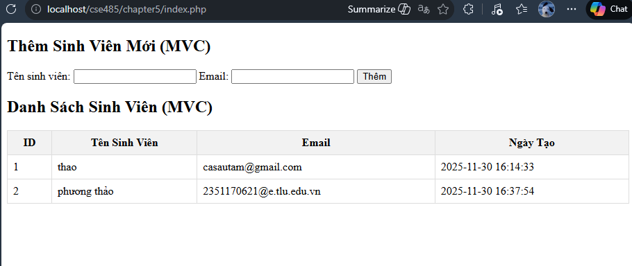

# A. Code đã hoàn thiện:

## 1. models/SinhVienModel.php 

```
<?php

// Hàm lấy tất cả sinh viên
function getAllSinhVien($pdo) {
    $sql = "SELECT * FROM sinhvien ORDER BY ngay_tao ASC";
    $stmt = $pdo->prepare($sql);
    $stmt->execute();
    return $stmt->fetchAll(PDO::FETCH_ASSOC);
}

// Hàm thêm sinh viên mới
function addSinhVien($pdo, $ten, $email) {
    $sql = "INSERT INTO sinhvien (ten_sinh_vien, email) VALUES (?, ?)";
    $stmt = $pdo->prepare($sql);
    $stmt->execute([$ten, $email]);
}
?>
```

## 2. views/sinhvien_view.php 
```
<!DOCTYPE html>
<html lang="vi">
<head>
    <meta charset="UTF-8">
    <title>Quản Lý Sinh Viên (MVC)</title>
    <style>
        table { width: 100%; border-collapse: collapse; }
        th, td { border: 1px solid #ddd; padding: 8px; }
        th { background-color: #f2f2f2; }
    </style>
</head>
<body>
    <div class="container">
        <h2>Thêm Sinh Viên Mới (MVC)</h2>
        <form action="index.php" method="POST">
            Tên sinh viên: <input type="text" name="ten_sinh_vien" required>
            Email: <input type="email" name="email" required>
            <button type="submit">Thêm</button>
        </form>

        <h2>Danh Sách Sinh Viên (MVC)</h2>
        <table>
            <tr>
                <th>ID</th>
                <th>Tên Sinh Viên</th>
                <th>Email</th>
                <th>Ngày Tạo</th>
            </tr>
            <?php 
            // View chỉ việc lặp qua biến $danh_sach_sv được truyền từ Controller
            foreach ($danh_sach_sv as $sv): 
            ?>
            <tr>
                <td><?php echo htmlspecialchars($sv['id']); ?></td>
                <td><?php echo htmlspecialchars($sv['ten_sinh_vien']); ?></td>
                <td><?php echo htmlspecialchars($sv['email']); ?></td>
                <td><?php echo htmlspecialchars($sv['ngay_tao']); ?></td>
            </tr>
            <?php endforeach; ?>
        </table>
    </div>
</body>
</html>
```

## 3. index.php

```
<?php
// 1. Import Model để sử dụng các hàm
require_once 'models/SinhVienModel.php';

// 2. Kết nối CSDL (Giữ nguyên từ Chapter 4)
$host = '127.0.0.1';
$dbname = 'cse485_web';
$username = 'root';
$password = '';

$dsn = "mysql:host=$host;dbname=$dbname;charset=utf8mb4";

try {
    $pdo = new PDO($dsn, $username, $password);
    $pdo->setAttribute(PDO::ATTR_ERRMODE, PDO::ERRMODE_EXCEPTION);
} catch (PDOException $e) {
    die("Kết nối thất bại: " . $e->getMessage());
}

// === LOGIC CỦA CONTROLLER ===

//Kiểm tra xem có hành động POST (thêm sinh viên) không
if (isset($_POST['ten_sinh_vien'])) {
    
    // Lấy $ten và $email từ $_POST
    $ten = $_POST['ten_sinh_vien'];
    $email = $_POST['email'];

    // Gọi hàm addSinhVien() từ MODEL
    addSinhVien($pdo, $ten, $email);

    // Chuyển hướng về index.php để "làm mới" trang
    header('Location: index.php');
    exit;
}

// (Luôn luôn) Gọi hàm getAllSinhVien() từ Model
// Lưu kết quả vào biến $danh_sach_sv để VIEW sử dụng
$danh_sach_sv = getAllSinhVien($pdo);

// Import tệp View ở cuối cùng
include 'views/sinhvien_view.php';
?>
```

## B. Ảnh chụp màn hình Kết quả (Trình duyệt Web): 



## Câu hỏi Phản biện


Trong code cũ (Chương 4), ta dùng vòng lặp while kết hợp với lệnh fetch() để lấy từng dòng dữ liệu từ đối tượng kết nối $stmt. Tuy nhiên, với cách viết Model hiện tại (hàm getAllSinhVien trả về fetchAll), tại sao chúng ta không thể sử dụng vòng lặp while trong View được nữa? Tại sao trong mô hình MVC, việc Model trả về một mảng dữ liệu tĩnh (Array) để View dùng foreach lại an toàn và đúng chuẩn hơn là việc truyền đối tượng kết nối sang View?


