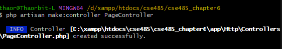
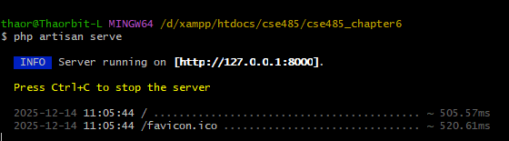
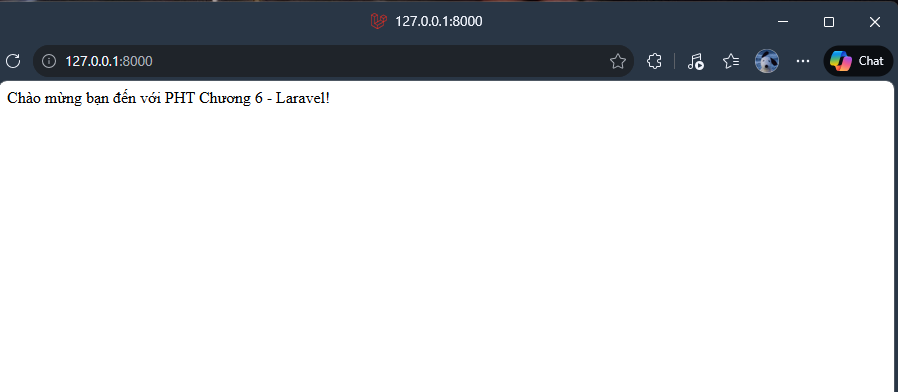
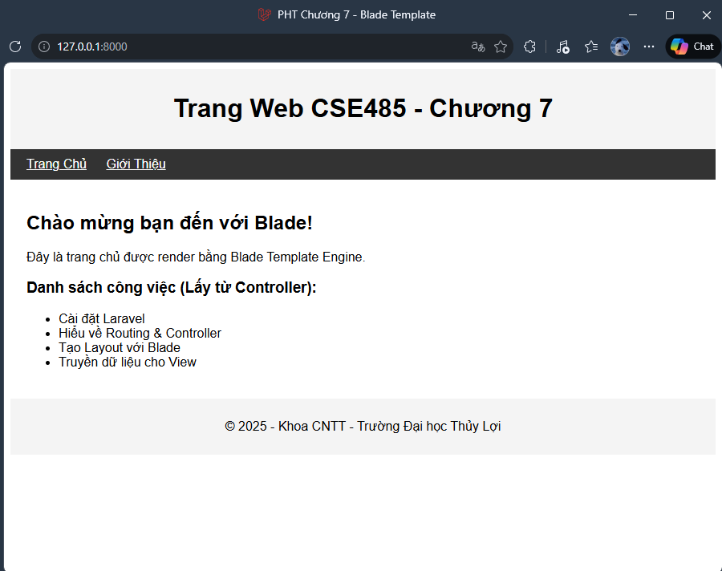
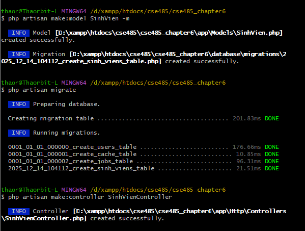
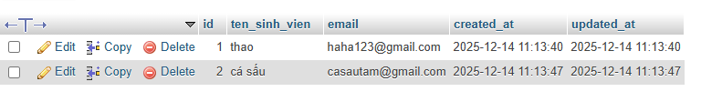
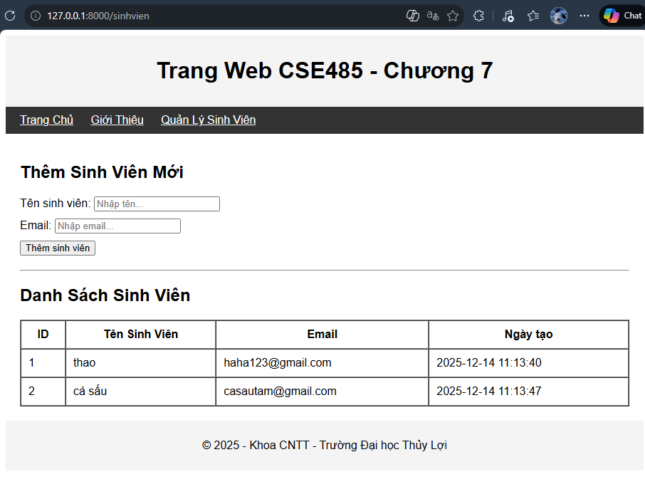
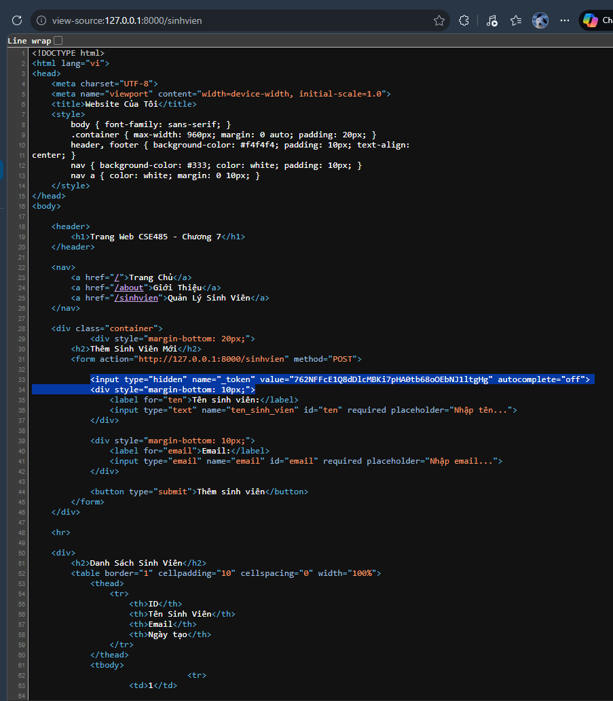
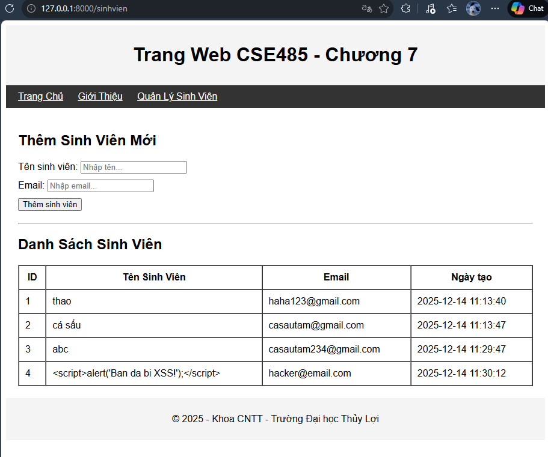

# A. Code đã hoàn thiện: 

## 1. Toàn bộ code của tệp app/Http/Controllers/PageController.php. 

```
<?php

namespace App\Http\Controllers;

use Illuminate\Http\Request;

class PageController extends Controller
{
    public function showHomepage() 
    { 
         return "Chào mừng bạn đến với PHT Chương 6 - Laravel!"; 
    } 

}
```

## 2. Toàn bộ code của tệp routes/web.php. 

```
<?php

use Illuminate\Support\Facades\Route;
use App\Http\Controllers\PageController;

Route::get('/', [PageController::class, 'showHomepage']); 
Route::get('/about', [PageController::class, 'showHomepage']); 
```

# B. Ảnh chụp màn hình Kết quả (3 ẢNH):

## 1. Ảnh 1 (Terminal): Chụp màn hình Terminal sau khi chạy lệnh php artisan make:controller PageController thành công.



## 2. Ảnh 2 (Terminal): Chụp màn hình Terminal đang chạy lệnh php artisan serve.  



## 3. Ảnh 3 (Trình duyệt Web): 


## 4. Câu hỏi Phản biện 

Câu hỏi của tôi là: Trong bài thực hành, em đã sử dụng Route::get và tự đặt tên hàm xử lý là showHomepage thay vì các tên chuẩn mặc định (như index). Tại sao với chức năng 'Trang chủ', chúng ta lại ưu tiên cách định nghĩa thủ công này? Việc tự đặt tên hàm như vậy có giúp code dễ hiểu hơn so với việc cố ép vào khuôn mẫu có sẵn (như Resource Controller) không?

#####

A. Code đã hoàn thiện

1. resources/views/layouts/app.blade.php 
```
<!DOCTYPE html> 
<html lang="vi"> 
<head> 
    <meta charset="UTF-8"> 
    <meta name="viewport" content="width=device-width, initial-scale=1.0"> 
    <title>{{ $title ?? 'Website Của Tôi' }}</title> 
    <style> 
        body { font-family: sans-serif; } 
        .container { max-width: 960px; margin: 0 auto; padding: 20px; } 
        header, footer { background-color: #f4f4f4; padding: 10px; text-align: 
center; } 
        nav { background-color: #333; color: white; padding: 10px; } 
        nav a { color: white; margin: 0 10px; } 
    </style> 
</head> 
<body> 
 
    <header> 
        <h1>Trang Web CSE485 - Chương 7</h1> 
    </header> 
 
    <nav> 
        <a href="/">Trang Chủ</a> 
        <a href="/about">Giới Thiệu</a> 
    </nav> 
 
    <div class="container"> 
        @yield('content') 
    </div> 
 
    <footer> 
        <p>&copy; 2025 - Khoa CNTT - Trường Đại học Thủy Lợi</p> 
    </footer> 
 
</body> 
</html>
```

2. resources/views/homepage.blade.php 
```
@extends('layouts.app') 

@section('content') 
    <h2>{{ $page_title }}</h2> 
    <p>{{ $page_description }}</p> 

    <h3>Danh sách công việc (Lấy từ Controller):</h3> 
     
    <ul> 
        @foreach($tasks as $task) 
            <li>{{ $task }}</li> 
        @endforeach 
    </ul> 
@endsection
```

3. app/Http/Controllers/PageController.php 
```
<?php 

namespace App\Http\Controllers; 

use Illuminate\Http\Request; 

class PageController extends Controller 
{ 
    public function showHomepage() 
    { 
        // Chuẩn bị dữ liệu
        $viewTitle = 'PHT Chương 7 - Blade Template'; 
        $pageTitle = 'Chào mừng bạn đến với Blade!'; 
        $pageDescription = 'Đây là trang chủ được render bằng Blade Template Engine.'; 
        $tasks = [ 
            'Cài đặt Laravel', 
            'Hiểu về Routing & Controller', 
            'Tạo Layout với Blade', 
            'Truyền dữ liệu cho View' 
        ]; 

        // Trả về View và truyền dữ liệu
        return view('homepage', [ 
            'title' => $viewTitle,           // Biến dùng cho <title> trong layout
            'page_title' => $pageTitle,      // Biến dùng cho <h2> trong view
            'page_description' => $pageDescription, 
            'tasks' => $tasks 
        ]); 
    } 
}
```

B. Ảnh chụp màn hình Kết quả (Trình duyệt Web): Chạy php artisan serve và truy cập 



4. Câu hỏi Phản biện 

Câu hỏi của tôi là: Theo mô hình MVC, View chỉ nên chịu trách nhiệm hiển thị. Tuy nhiên, trong file homepage.blade.php, em vẫn phải dùng vòng lặp logic @foreach để duyệt mảng $tasks. Vậy ranh giới chính xác của việc 'xử lý logic' là ở đâu? Ví dụ: Nếu em muốn sắp xếp danh sách công việc theo thứ tự A-Z, em nên thực hiện việc sắp xếp đó ngay tại View (bằng code PHP/Blade) hay bắt buộc phải xử lý xong ở Controller rồi mới truyền sang?

######

# A. Code đã hoàn thiện: 

## 1. Dán (paste) code hàm up() trong file Migration (..._create_sinh_viens_table.php). 

```
<?php

use Illuminate\Database\Migrations\Migration;
use Illuminate\Database\Schema\Blueprint;
use Illuminate\Support\Facades\Schema;

return new class extends Migration
{
    /**
     * Run the migrations.
     */
    public function up(): void
    {
        Schema::create('sinh_viens', function (Blueprint $table) {
            $table->id();
            $table->string('ten_sinh_vien', 255); 
            $table->string('email', 255)->unique();
            $table->timestamps();
        });
    }

    /**
     * Reverse the migrations.
     */
    public function down(): void
    {
        Schema::dropIfExists('sinh_viens');
    }
};

```

## 2. Dán (paste) toàn bộ code file app/Models/SinhVien.php. 

```
<?php 
namespace App\Models; 
use Illuminate\Database\Eloquent\Factories\HasFactory; 
use Illuminate\Database\Eloquent\Model; 
 
class SinhVien extends Model 
{ 
    use HasFactory; 
 
    // Thêm mảng $fillable 
    protected $fillable = [ 
        'ten_sinh_vien', 
        'email', 
    ]; 
} 
```

## 3. Dán (paste) toàn bộ code file app/Http/Controllers/SinhVienController.php. 

```
<?php 
namespace App\Http\Controllers; 

use Illuminate\Http\Request; 
// TODO 10: Import Model SinhVien 
use App\Models\SinhVien; 

class SinhVienController extends Controller 
{ 
    // Phương thức index() (SELECT) 
    public function index() 
    { 
        // TODO 11: Dùng Eloquent ::all() để lấy toàn bộ sinh viên 
        // Thay thế cho SQL: "SELECT * FROM sinh_viens"
        $danhSachSV = SinhVien::all(); 
 
        // TODO 12: Trả về 1 view 'sinhvien.list' và truyền $danhSachSV 
        // Hàm compact('danhSachSV') tương đương với ['danhSachSV' => $danhSachSV]
        return view('sinhvien.list', compact('danhSachSV')); 
    } 
 
    // Phương thức store() (INSERT) 
    public function store(Request $request) 
    { 
        // TODO 13: Lấy toàn bộ dữ liệu từ form 
        // Lấy tất cả input (tên, email...) người dùng nhập
        $data = $request->all(); 
 
        // TODO 14: Dùng Eloquent ::create() để lưu vào CSDL 
        // Thay thế cho SQL: "INSERT INTO sinh_viens (ten, email) VALUES (...)"
        // Yêu cầu: Model SinhVien phải khai báo $fillable = ['ten_sinh_vien', 'email']
        SinhVien::create($data); 
 
        // TODO 15: Chuyển hướng về trang danh sách 
        // Sau khi thêm xong, quay lại trang danh sách để người dùng thấy kết quả
        return redirect()->route('sinhvien.index'); 
    } 
}
```

## 4. Dán (paste) code 2 route trong routes/web.php. 

```
<?php

use Illuminate\Support\Facades\Route;
use App\Http\Controllers\PageController;
use App\Http\Controllers\SinhVienController; 

Route::get('/', [PageController::class, 'showHomepage']); 
Route::get('/about', [PageController::class, 'showHomepage']); 
Route::get('/sinhvien', [SinhVienController::class, 'index'])->name('sinhvien.index'); 
Route::post('/sinhvien', [SinhVienController::class, 'store'])->name('sinhvien.store'); 

```
# B. Ảnh chụp màn hình Kết quả (3 ẢNH):

## 1. Ảnh 1 (Terminal): Chụp màn hình Terminal sau khi chạy php artisan make:model ... -m  VÀ php artisan migrate thành công. 


## 2. Ảnh 2 (phpMyAdmin): Chụp màn hình tab "Structure" (Cấu trúc) của bảng sinh_viens trong CSDL, cho thấy rõ các cột id, ten_sinh_vien, email, created_at. 


## 3. Ảnh 3 (Trình duyệt Web): Chụp ảnh màn hình trang /sinhvien, sau khi đã dùng form thêm 1-2 sinh viên (chứng minh ::create() và ::all() đều hoạt động). 


## 4. Câu hỏi Phản biện (Bắt buộc) 
Tại phương thức store() trong SinhVienController, sau khi lưu dữ liệu thành công, tại sao chúng ta lại dùng return redirect()->route(...) để tải lại trang, thay vì dùng return view(...) để hiển thị danh sách ngay lập tức cho nhanh? Hành động redirect này giúp giải quyết vấn đề gì khi người dùng lỡ tay bấm F5 (Refresh) sau khi gửi form?

#####
Lỗi XSS: Do dùng {!! !!} để in dữ liệu (cho phép chạy mã Script độc hại).

Lỗi CSRF: Do thiếu thẻ @csrf (sẽ bị lỗi 419 khi submit hoặc bị hacker giả mạo form).

## A. Code đã hoàn thiện: 

# 1. Dán (paste) code của khối <form> trong tệp list.blade.php (chứng minh bạn đã thêm @csrf). 
```
<form action="{{ route('sinhvien.store') }}" method="POST">
            
            @csrf

            <div style="margin-bottom: 10px;">
                <label for="ten">Tên sinh viên:</label>
                <input type="text" name="ten_sinh_vien" id="ten" required placeholder="Nhập tên...">
            </div>

            <div style="margin-bottom: 10px;">
                <label for="email">Email:</label>
                <input type="email" name="email" id="email" required placeholder="Nhập email...">
            </div>

            <button type="submit">Thêm sinh viên</button>
        </form>
```
## 2. Dán (paste) code của khối @foreach trong tệp list.blade.php (chứng minh bạn dùng {{ }}). 
```
 @foreach($danhSachSV as $sv)
    <tr>
        <td>{{ $sv->id }}</td>
        <td>{{ $sv->ten_sinh_vien }}</td>
        <td>{{ $sv->email }}</td>
        <td>{{ $sv->created_at }}</td>
    </tr>`
@endforeach
```
# B. Ảnh chụp màn hình Kết quả (BẮT BUỘC 2 ẢNH): 
## 1. Ảnh 1 (Bằng chứng Chống CSRF): Tải trang /sinhvien, nhấn chuột phải $\rightarrow$ View Page Source (Xem nguồn trang). Chụp ảnh màn hình mã nguồn HTML, khoanh tròn vào thẻ <input type="hidden" name="_token" ...> mà @csrf đã tự động tạo ra. 



## 2. Ảnh 2 (Bằng chứng Chống XSS): Chụp ảnh màn hình trang /sinhvien sau khi bạn đã thêm sinh viên ở (TODO 6 & 7). Ảnh phải cho thấy dòng chữ <script>alert('Ban da bi XSS!');</script> được in ra dưới dạng text trên bảng, chứ KHÔNG CÓ popup "alert" nào hiện lên. 


# 4. Câu hỏi Phản biện (Bắt buộc) 
 
Câu hỏi của tôi là: Nếu giá trị token 762NFF... hiển thị rõ ràng trong mã nguồn (View Source) như thế này, thì hacker cũng có thể vào xem và copy chuỗi này dán vào form giả mạo của hắn. Vậy tại sao cơ chế này vẫn bảo vệ được website? Phải chăng token này còn được liên kết bí mật với một yếu tố nào đó phía Server (Session) mà hacker không thể giả mạo được?